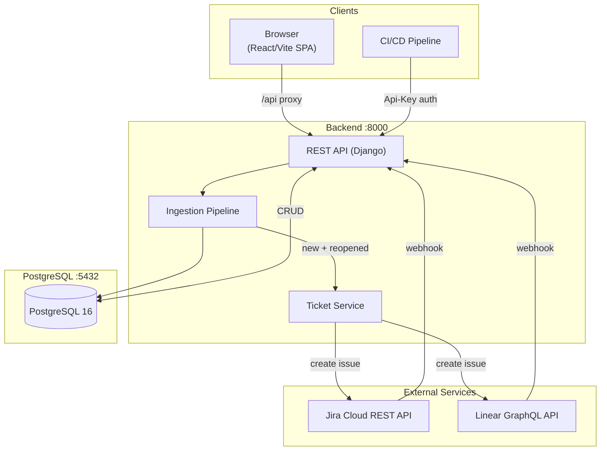
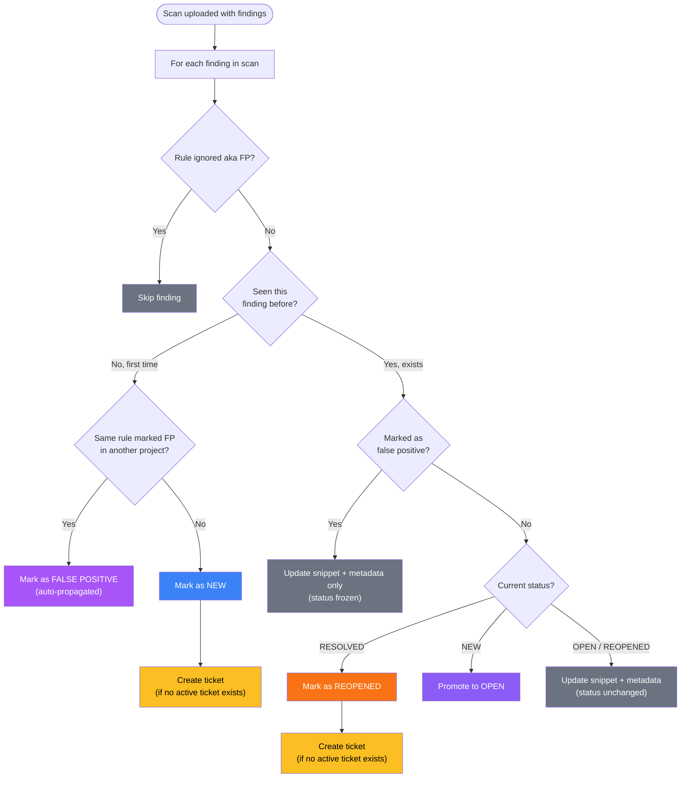

# Corgea Takehome project

---

## Problem Statement

We are frustrated with the way security vulnerabilities are tracked in our codebase. We run automated security scans using tools like Semgrep Community Edition with this command:

```bash
semgrep scan --config auto --json --json-output findings.json
```

which produce JSON reports of issues. Every time we scan, we need to go through all issues, even though the majority are false positives and can be ignored, and it's impossible to see which issues are recurring, who is responsible for addressing them, and whether any have been fixed or reopened.

We need a way to collect these findings, keep track of their status over time, assign them to team members, and maintain a history of changes so we can see when an issue was fixed, reopened, or reassigned. The current process makes it difficult for us to triage and manage security issues efficiently, and it's impacting our ability to maintain secure code.

---


## System Design



---

## Finding Lifecycle



---


## Quick Start

### Prerequisites

- Docker and Docker Compose
- Ports 3000, 8000, and 5433 available

### Steps

```bash
# 1. Clone and start
git clone <repo-url>
cd corgea-take-home
docker compose up --build

# 2. Open http://localhost:3000 and register an account

# 3. Create a project, then upload a Semgrep JSON report

# 4. Or push from CI/CD:
semgrep scan --config auto --json --json-output results.json
curl -X POST http://localhost:8000/api/projects/<slug>/scans/push/ \
  -H "Authorization: Api-Key <your-project-api-key>" \
  -H "Content-Type: application/json" \
  -d @results.json
```

---
